# ISUCON13 × Azure SRE Agent PoC

ISUCON13 過去問「ISUPIPE」を Azure VM 上に構築し、Azure SRE Agent が ISUCON MCP Server 経由でパフォーマンスチューニングを自律的に行えるかを検証する PoC 環境。

## アーキテクチャ

```mermaid
graph TB
    subgraph rg-sreagent ["rg-isucon13-sreagent"]
        subgraph sre ["SRE Agent"]
            isucon-agent["isucon Agent"]
            skills["Skills"]
            connector["MCP Connector"]
            isucon-agent --> skills
            isucon-agent --> connector
        end
    end

    subgraph rg-system ["rg-isucon13-system"]
        subgraph aca ["ACA"]
            mcp["ISUCON MCP Server"]
        end

        subgraph vnet ["VNet"]
            subgraph snet-vms ["snet-vms"]
                vm1["contest-vm-1"]
                vm2["contest-vm-2"]
                vm3["contest-vm-3"]
                bench["benchmark-vm"]
            end
            subgraph snet-aca ["snet-aca"]
            end
        end

    end

    connector -- "HTTPS" --> mcp
    mcp -- "SSH" --> vm1 & vm2 & vm3 & bench
    aca -.-> snet-aca
```



詳細は [docs/](docs/) を参照。

## デプロイ

```bash
az login
azd auth login
azd up                          # ~10分: インフラ + ISUCON MCP Server + SRE Agent 構成
```

### パラメータ（すべてオプション）

| 変数 | デフォルト | 説明 |
|------|-----------|------|
| `AZURE_LOCATION` | (azd が初回に確認) | VM/インフラのリージョン |
| `SRE_AGENT_LOCATION` | `australiaeast` | SRE Agent リージョン (`australiaeast`\|`eastus2`\|`swedencentral`) |
| `AGENT_TIER` | `L100` | エージェント構成ティア (`L100`\|`L200`\|`L300`\|`L400`) |
| `ENABLE_MONITORING` | `false` | Log Analytics + App Insights + AMA (VM メトリクス収集) |
| `VM_SIZE_CONTEST` | `Standard_D2s_v5` | 競技サーバー (vm1-vm3) の VM サイズ |
| `VM_SIZE_BENCH` | `Standard_D4s_v5` | ベンチマーカー (bench) の VM サイズ |

### エージェントティア

| Tier | Agents | Skills (累積) | 概要 |
|------|--------|--------------|------|
| L100 | 1 | 1 | 汎用エージェント + MCP ツールガイド |
| L200 | 4 | 4 | オーケストレーター + 専門3体 + DB index/N+1/icon caching |
| L300 | 4 | 9 | + alp/slow query/Go DB/MySQL buffer/nginx tuning |
| L400 | 4 | 16 | + multi-server/DNS/LB/cache/strategy/patterns/rollback |

デプロイ後にティアを変更する場合:

```bash
bash scripts/sreagent-setup.sh L200   # セットアップ + キック
bash scripts/sreagent-run.sh --watch  # 動向をウォッチ
```

## クリーンアップ

```bash
azd down --purge
```

## ライセンス

[MIT License](LICENSE)

> ISUCON13 ([isucon/isucon13](https://github.com/isucon/isucon13)) は MIT License (Copyright (c) 2023 ISUCON13 Contributors)
